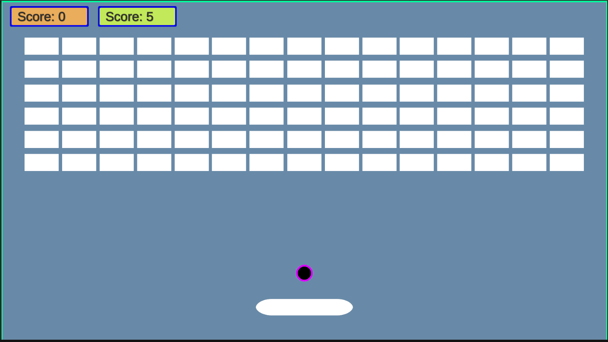

# Arknoid

**Arknoid** is a classic arcade-style game where the player controls a paddle to bounce a ball and destroy all the blocks on the screen. It is inspired by the legendary "Breakout" game, and it provides a fun and challenging experience with various power-ups and different levels.

## Gameplay

## Features

- **Classic gameplay**: Bounce a ball to break blocks..
- **Simple controls**: Easy to play with mouse.
- **High score tracking**: Compete to get the highest score.
- **Smooth animations**: Clean and responsive gameplay experience.

### Controls

- **Arrow keys** to control the paddle.
- **Esc** to pause the game.

*Watch the paddle and ball in action as you try to break all the blocks!*
